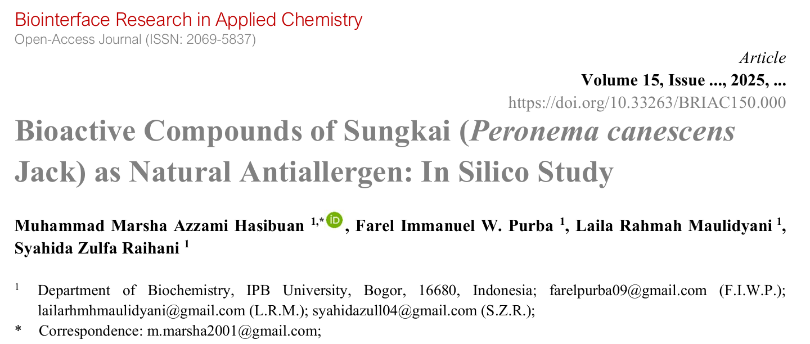
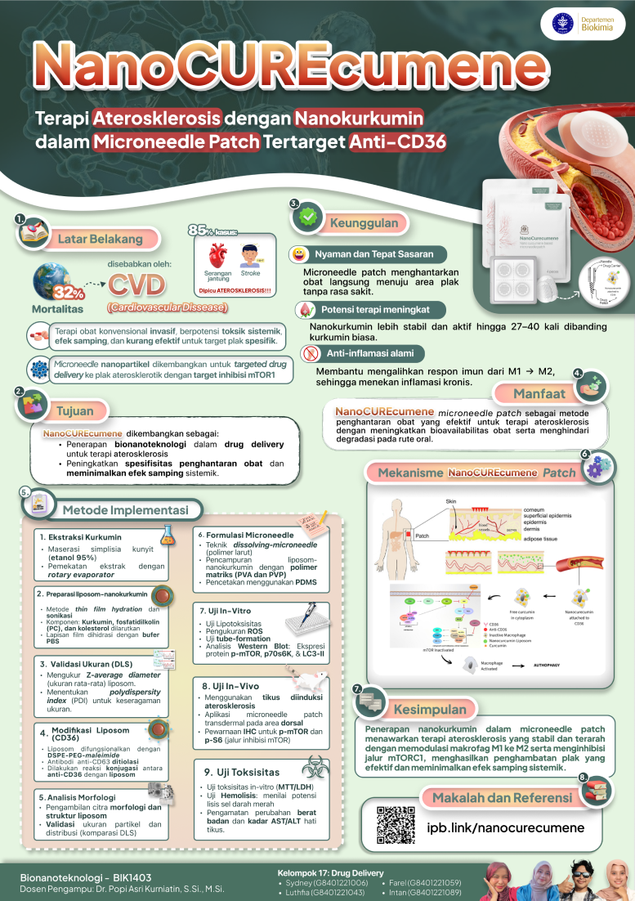
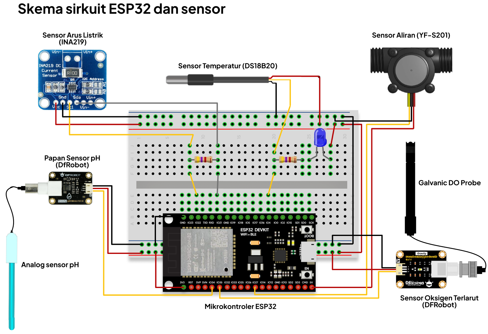
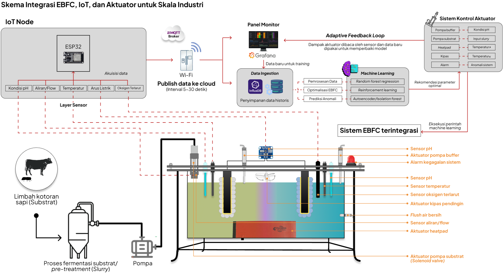

<h1>Hi, I'm Farel Immanuel W. Purba! 👋</h1>
<h2>🧬 <a href="https://biokimia.ipb.ac.id/">Final Year Biochemistry Student</a> | <a href="https://www.linkedin.com/in/farel-purba-2480b91b5">Genome Analysis Enthusiast</a></h2>

I am a dedicated undergraduate student specializing in **biochemistry, bioinformatics, and metagenomics data analysis**. Currently working on Whole Metagenome Sequencing (WMS) analysis from IPB's Arboretum Forest Soil environment, focusing on antimicrobial resistance genes.

### 🔬 Research Interests
- Whole Genome Sequencing (WGS) & Metagenomics
- Bioinformatics & Computational Biology
- Big Data Analytics using R
- Genome-based insights for Precision Medicine
- Antimicrobial Resistance (AMR) genes

---

## 📚 Publications & Academic Work

### **Book Publication**
- **Co-Author** | *"Mengungkap Genom Bakteri: Analisis WGS dan Identifikasi Gen Resistensi Antimikroba (AMR)"*

  

  - Published by IPB Press (June - December 2025)
  - Contributed chapters on sequencing technologies, analysis programs, data visualization, and AMR gene identification
  - Designed book cover and layout
  - [View Book](https://drive.google.com/file/d/1bOb6Z5RqBn58FYrCdhztDNvgZcoqn0oB/view?usp=drive_link)

### **Research Publication**
- **2nd Author** | *"Bioactive compounds of Sungkai (Peronema canescens Jack) as Natural Antiallergen: In Silico Study"*

  

  - Published in Biointerface Research in Applied Chemistry (April - September 2025)

  

  - Conducting molecular docking and density functional theory (DFT) analysis to carry out drug design of natural antihistamines.
  - [Read Paper](https://drive.google.com/file/d/1p10BNO0DO3QGTcUQbnsWPDcFty20F0of/view?usp=drive_link)

### **Capstone Project**
- **Bionanotechnology** | NanoCure: Atherosclerosis therapy using Anti-CD36 targeted microneedle patch with encapsulated nanourcumene

  

- **Biochemistry Innovation 4.0** | Smart Enzymatic Biofuel Cell Nanomaterial based on IoT and Machine learning for renewable energy in the era of global industrial transformation 5.0
  
  - Designing IoT scheme for smart EBFC
  

  
  

  - Conducting scheme design for EBFC workflow
  

  
  

  
---

## 💻 Technical Projects
### 🧬 **Bioinformatics & Genomics**
**Metagenomic Taxonomy Visualization** | *Open Source Tool Development*

  - **Overview**: Developed a specialized R toolkit to automate the processing and visualization of taxonomix classification results from metagenomic data (specifically Kraken2/Bracken outputs).
  - **Key Features**
    - **Automated Data Cleaning**: Implemented filters to remove "unclassified" reads for focused analysis.
    - **Smart Re-normalization**: Algorithmically recalculates relative abundances based solely on classified reads.
    - **Dynamic Visualization**: Generates publication-ready. **Stacked Barplots** (for community composition) and **Dumbbell plots** (for abundance shifts).
    - [View Repository](https://github.com/prbfarel/Metagenomic-Taxonomy-Visualization)

**Soil Metagenome Analysis** | *Current Research*
  - Collecting sample from IPB Arboretum Forest's soils and exracting microbiome DNA using FastDNA SPIN Kit for Soil
  - Conducting DNA gel electrophoresis, Qubit, and NanoDrop for DNA quality & quantity evaluation
  - Whole metagenome sequencing using PromethION 2 Solo
  - Metagenome reads analysis through quality control (fastplong), assembly (metaFlye), binning (MetaBAT2 & CONCOCT), annotation (both taxonomy and functional), and antimicrobial resistance gene identification
  - Focus: Antimicrobial resistance gene identification
  - Tools: R Studio, UseGalaxy platform

---

## 🛠️ Technical Skills

### **Bioinformatics & Data Analysis**

- R Studio for genomic data analysis
- UseGalaxy platform (QC, assembly, binning, annotation, BGC)
- Whole Genome Sequencing with ONT (Oxford Nanopore Technologies)
- Metagenomics data pipeline

### **Molecular Modeling & Structural Biology**
- 3D Protein Modelling: Yasara, PyMol
- Molecular Docking Studies
- In Silico Drug Design

### **Laboratory Techniques**
- Basic laboratory instrumentation
- PCR and primer design
- Plasmid extraction
- Cell transformation
- Nucleic acid and protein engineering

### **Design & Productivity**

- Adobe Photoshop, Illustrator
- Figma
- Microsoft Office Suite

---

## 🎓 Teaching Experience

**Laboratory Assistant** | *IPB University*
- **General Biochemistry** (Veterinary Medicine) | Aug - Dec 2025
  - Supporting both regular and international graduate programs
- **Nucleic Acid & Protein Engineering** (Biochemistry Dept.) | Aug - Dec 2025
  - Teaching primer design, plasmid extraction, cell transformation
- **Basic Chemistry** | Aug 2024 - Dec 2025
  - Assisting first-year students in chemistry practicum

---
## 🏆 Leadership & Achievement
### **Organizational Leadership**
- **Head of Media Branding Division** | Get Closer to Biochemistry (GCTB) 2024
  - Led media branding for 98 participants orientation period
- **Staff, CIC Division** | CREBS (Community of Research and Education in Biochemistry)
  - Managed social media content and biochemistry information distribution
  - Developed design concepts (color palettes, layouts)
- **Staff, Biomolecular Division** | ONT Sequencing Workshop 2025

### **Awards**
- 🥇 **Gold Medal** - Mathematics Olympiad | Indonesian Science Competition (ISC)
- ⭐ **Best Staff** - CIC Division, CREBS

---

## 📫 Connect With Me

📍 Bogor, Indonesia  
📧 farelpurba09@gmail.com  
📱 +6281262879568

---

<i>"Committed to continuous learning and innovation in biochemistry and bioinformatics"</i>

---

*GPA: 3.60 | IPB University - Department of Biochemistry, Division of Biomolecules*
