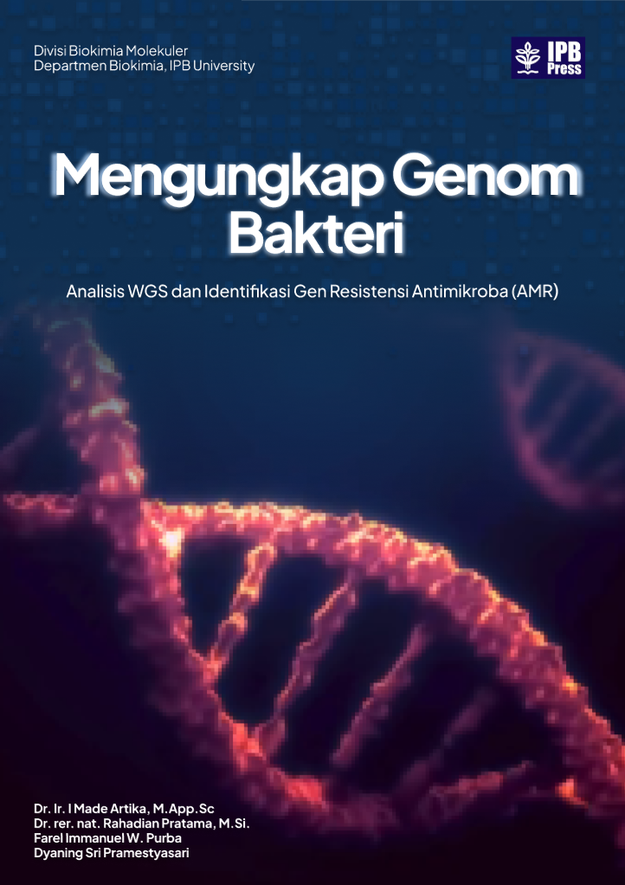
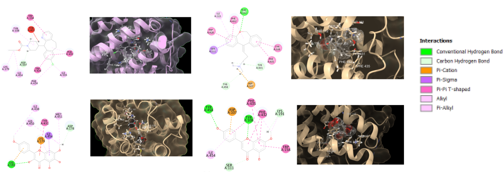

<h1>Hi, I'm Farel Immanuel W. Purba! 👋</h1>
<h2>🧬 <a href="https://biokimia.ipb.ac.id/">Final Year Biochemistry Student</a> | <a href="https://www.linkedin.com/in/farel-purba-2480b91b5">Genome Analysis Enthusiast</a></h2>

I am a dedicated undergraduate researcher specializing in **biochemistry, bioinformatics, and metagenomics data analysis**. Currently working on Whole Metagenome Sequencing (WMS) analysis from IPB's Arboretum Soil environment, focusing on antimicrobial resistance genes.

### 🔬 Research Interests
- Whole Genome Sequencing (WGS) & Metagenomics
- Big Data Analytics using R
- Bioinformatics & Computational Biology
- Antimicrobial Resistance (AMR) genes

---

## 📚 Publications & Academic Work

### **Book Publication**
- **Co-Author** | *"Mengungkap Genom Bakteri: Analisis WGS dan Identifikasi Gen Resistensi Antimikroba (AMR)"*

  

  - Published by IPB Press (June - December 2025)
  - Contributed chapters on sequencing technologies, analysis programs, data visualization, and AMR gene identification
  - Designed book cover and layout
  - [View Publication](#) *(link when available)*

### **Research Publication**
- **2nd Author** | *"Bioactive compounds of Sungkai (Peronema canescens Jack) as Natural Antiallergen: In Silico Study"*
  - Published in Biointerface Research in Applied Chemistry (April - September 2025)

  

  - Conducting molecular docking and density functional theory (DFT) analysis to carry out drug design of natural antihistamines.
  - [Read Paper](#) *(link when available)*

### **Capstone Project**
- **Bionanotechnology** | NanoCure: Atherosclerosis therapy using Anti-CD36 targeted microneedle patch with encapsulated nanourcumene
- **Biochemistry Innovation 4.0** | Smart Enzymatic Biofuel Cell Nanomaterial based on IoT and Machine learning for renewable energy in the era of global industrial transformation 5.0

---

## 💻 Technical Projects

### 🧬 **Metagenomics & Genome Analysis**
- **Soil Metagenome Analysis** | *Current Research*
  - Whole metagenome sequencing analysis of IPB's Arboretum soil environment
  - Focus: Antimicrobial resistance gene identification
  - Tools: R Studio, UseGalaxy platform
  - Methods: Quality control, assembly, binning, annotation, and BGC analysis

### 🔬 **In Silico Studies**
- **Molecular Docking Analysis** | *Sungkai Plant Research*
  - 3D protein modeling and molecular docking
  - Tools: Yasara, PyMol
  - Application: Natural antiallergen compound identification

### 🍵 **Tea Processing Research** | *IRITC Internship*
- **Black Tea Quality Analysis** (June - August 2024)
  - Analyzed variations in enzymatic oxidation and drying time effects
  - Focus: Catechin oxidation, physical quality, and organoleptic properties
  - [View Research](#) *(link when available)*

---

## 🛠️ Technical Skills

### **Bioinformatics & Data Analysis**

- R Studio for genomic data analysis
- UseGalaxy platform (QC, assembly, binning, annotation, BGC)
- Whole Genome Sequencing with ONT (Oxford Nanopore Technologies)
- Metagenomics data pipeline

### **Molecular Modeling & Structural Biology**
- 3D Protein Modelling: Yasara, PyMol
- Molecular Docking Studies
- In Silico Drug Design

### **Laboratory Techniques**
- Basic laboratory instrumentation
- PCR and primer design
- Plasmid extraction
- Cell transformation
- Nucleic acid and protein engineering

### **Design & Productivity**

- Adobe Photoshop, Illustrator
- Figma
- Microsoft Office Suite

---

## 🎓 Teaching Experience

**Laboratory Assistant** | *IPB University*
- **General Biochemistry** (Veterinary Medicine) | Aug - Dec 2025
  - Supporting both regular and international graduate programs
- **Nucleic Acid & Protein Engineering** (Biochemistry Dept.) | Aug - Dec 2025
  - Teaching primer design, plasmid extraction, cell transformation
- **Basic Chemistry** | Aug 2024 - present
  - Assisting first-year students in chemistry practicum

---

## 🏆 Achievements & Leadership

### **Awards**
- 🥇 **Gold Medal** - Mathematics Olympiad | Indonesian Science Competition (ISC)
- ⭐ **Best Staff** - CIC Division, CREBS

### **Organizational Leadership**
- **Head of Media Branding Division** | Get Closer to Biochemistry (GCTB) 2024
  - Led media branding for 98 participants orientation period
- **Staff, CIC Division** | CREBS (Community of Research and Education in Biochemistry)
  - Managed social media content and biochemistry information distribution
  - Developed design concepts (color palettes, layouts)
- **Staff, Biomolecular Division** | ONT Sequencing Workshop 2025

---

## 📫 Connect With Me

📍 Bogor, Indonesia  
📧 farelpurba09@gmail.com  
📱 +6281262879568

---

<i>"Committed to continuous learning and innovation in biochemistry and bioinformatics"</i>

---

*GPA: 3.60 | IPB University - Department of Biochemistry, Division of Biomolecules*
